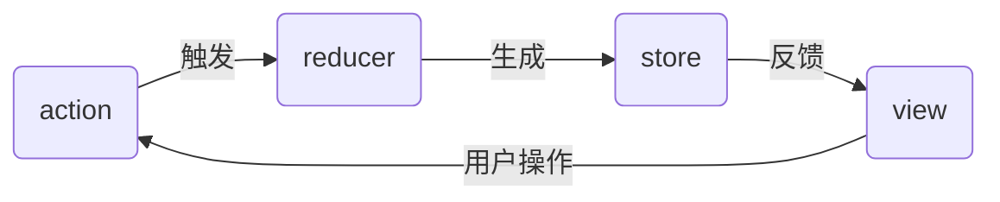

# 概述
应用流转图

```mermaid
	graph LR
	A(action) -->|触发| B(reducer)
	B -->|生成| C(store)
	C -->|反馈| D(view)
	D -->|用户操作| A
```
和 [[vuex]] 作用相同，但学习成本更高
# 基本
1. 单向数据流
2. [[react-redux]]：react 应用连接 redux
3. 异步 action
4. [[中间件]] 

store
state
action
reducer