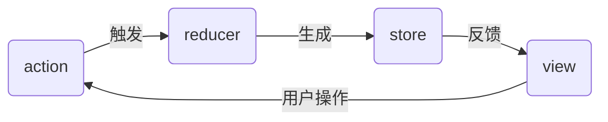

# 概述
和 [[vuex]] 作用相同，但学习成本更高
应用流转图

带有中间件的数据流图 ![[Pasted image 20230710220731.png]]
## 组成
###  dispatch
工具函数，将 action 传递给 reducer
###  action
特性
	1. 一个 [[Object]] 
	2. 带有 type，需要传递的 value 值
###  reducer
一个大型应用不只一个，可开发一个总的 reducer 管理所有 reducer
特性
	1.  [[纯函数]] 
	2. 接收 state 与 action 两个对象，根据 action 决定处理逻辑，返回 state 对象
###  store
## 流程
 根据 action 种类与传参触发 reducer 的更新逻辑，生成新 state，反映到 view
# 基础
##  单向数据流

## 异步action
1. 从 redux 库同时引入 createStore 与 applyMiddleWare
2. 引用三方库提供中间件
	1. redux-thunk
	2. redux-promise
	3. redux-saga
3. 在 createStore 第二个参数传入 applyMiddleWare (thunk)
4. 使用异步 action ![[Pasted image 20230710205953.png]] 
store
state
action
reducer
## redux 中间件
原理
action 是对象；reducer 是接收 state 与 action 返回新 state 的纯函数，均无法改造。对 dispatch 做改造：在其中插入自己的逻辑
# 相关
[[react-redux]]：react 应用连接 redux
[核心概念 · Redux](https://www.redux.org.cn/docs/introduction/CoreConcepts.html) 
 