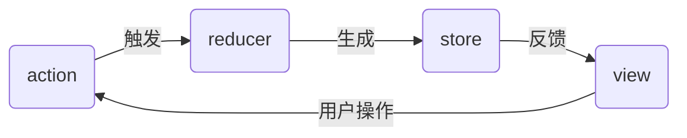

# 概述
应用流转图

和 [[vuex]] 作用相同，但学习成本更高
# 基础
1. 单向数据流
2. [[react-redux]]：react 应用连接 redux
3. 异步 action
## 如何异步更新 action？
1. 从 redux 库同时引入 createStore 与 applyMiddleWare
2. 引用三方库提供中间件
	1. redux-thunk
	2. redux-promise
	3. redux-saga
3. 在 createStore 第二个参数传入 applyMiddleWare (thunk)
4. 使用异步 action ![[Pasted image 20230710205953.png]] 
store
state
action
reducer
## redux 中间件
原理
