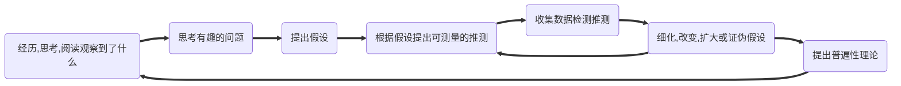

#flashcards 
# 理论
## 学习时大脑是如何运作的
### 编故事
学习，就是大脑如何处理五官的输入。
### 遗忘
# 心法
1. 以慢为快
	1. 大忌
		1. 一口气学几个小时（==每看完一小节，就整体回忆一下==）
		2. 你的目的不是读完，而是**消化**，是**解决问题**。
	2. 高效的学习，只是知识融会贯通的附加结果，不是主要结果。
	3. 把慢工夫用在==有[[价值]]的问题== 
		1. 学外语：有价值的问题不是语法与修辞不会，而是会影响沟通的东西
		2. 专业：吃透理论的本质
2. [[思维]]方式大于技巧
	1. [[概念]] 
	2. 概念之间是==如何联系==的
	3. 概念之间==联系的数量==越多，越不可能被忘记（几十根安全带拉着的人不会掉下去）
3. 对知识进行最大程度的*简化，压缩*（用最简单的词汇解释最复杂的知识），然后进行推演/[[推理]]/演化
4. 与其每天看书，文章，技巧，不如更多关注自己。
5. 定下一个目标，==每天观察自己和目标的差距==。
6. 不要重读、划重点、总结概述，而是通过[[提问]]来复习。
7. 把自己当成一张*白纸*，一块海绵。
8. 觉察当下之中眼前的，心中的，脑中的一切存在。不要抗拒，抵触。
#  知识
## 本质
定义：知识是一张大网，要了解***事物的真正含义***，就要把这个事物与了解的其他事物联系，**通过一种已知事物认识另一种事物**。
试图寻找、创造==知识间的关联==，并变成自己的观点。不要只见树木，不见森林。记忆只是学习的一少部分，要全面地、联系地认识学习
而后：把想法内化，知识整合，从**各种角度**看问题，直到找到合适的办法。
![[整体性学习.svg]] 
## 分类
1. 整体性学习：信息的结构
	1. [[观点信息]] 
	2. [[随意信息]] 
	3. [[过程信息]] 
	4. [[抽象信息]] 
	5. [[具体信息]] 
2. 超速学习
	1. 概念：理解
	2. 事实：记忆
	3. 程序：练习
	4. 元知识：掌握
## 联系方式
1. 结构[^1] 
	1. 一系列紧密联系的知识。所有==知识及其联系==的总和。知识结构是大脑中的==地图==（每个地点及其联系）。建立结构就是创建地图，在每个地点之间联系，在各种知识之间建立**尽可能多的联系**。
	2. 每遇见一个新知识都要努力建立**良好**（概念之间的联系非常多，且有条不紊）的结构（是一座设计良好的城市）。
	3. 举例：成熟的结构（模拟其他知识最好的途径）
		1. 感知结构：其他结构的基础。五感
		2. 关系结构：A与B相邻→A与B是邻居
		3. 交通：四通八达，虽然流量很大却从不堵塞。
2. 模型[^2]：被简化的结构，结构的雏形。一种强大的提示，帮助想起所有知识。
	1. 目的：**压缩信息**，用于快速学习新概念。把多个关键思想压缩在一个点，可用于在上面添加新内容。对于快速学习新概念非常重要（新的知识在这个基础上进行联系与优化）。
	2. 通过[[内视觉]]，简单把**最底层，最核心**的几个知识压缩在一起。不需要很精确，只要把一些观念综合起来，使它们更容易理解，把握。在这个基础上不断理解与纠正，*引申*出一个学科的全部知识。
	3. 举例：可以它为原点压缩结构
		1. “变量”的模型就是多种罐子。
		2. 函数的模型就是一个铅笔刀。给一个输入还一个输出；一本书的目录；[[git]]中的commit
3. 高速公路：结构之间的关系
		1. 用另一个科目/生活去模拟，比喻知识。如：生活经验
		2. 人们总在强调良好的结构，高速公路却能带来创造力。它把不同的专业科目联结在一起，建立起新结构，产生新知识。（治理国家的知识用于友谊，社会地位，管理等方面的经验）
# 学习
## 目的
不是
	1. 机械地创造量变。一天读了多少章
	2. 纯靠记忆来解决问题，通过考试。
	3. 花大量时间，大量努力，搞垮身体与内心。却忘得很快。
	4. 大脑只是复读机，没有原创能力与解决问题的能力
是
	1. 理解深刻，用时很短，记得多，**信息的组织方式**（大网）本身就便于快速学习、深刻理解、轻松记忆。短时间内可记住所有相关==概念及其联系==。
	2. 脑子里做了多少事情，而不是手上写了多少字，敲了多少字。
	3. 融会贯通，打通了[[知识]]之间的阻塞，能解决所有底层原理相通的[[问题]]。
		1. 一个[[概念]]的[[意义]]，作用，影响范围，可能要5，6天
		2. 对某个[[主题]]的认识更深入，吃透
	4. 做任何事都能又快又好。
应用到生活中
### [[内心]] 
[[当下]] 
### [[健身|身体]] 
### [[思维]] 
## [[策略]] 
### 使用最少的时间，达到最深的理解、最久的记忆、最灵活的应用。
## 内容
### [[自由技艺]] 
## 方式
[[阅读]]，视频，音频，网站
[[经历]] 
## 方法
学习的[[技术]] 
1. 工具选择
	1. [[思维导图]]用于记忆**知识框架**，提供地图
	2. [[记忆宫殿]]用于记忆具体**知识点**
	3. [[概念图]]用于检查知识盲点
2. 快速获取信息
	1. [[快速阅读]] 
	2. [[笔记流]] 
	3. [[SQ3R]] 
3. 创建模型（就是联系观点）
	1. [[比喻]]（抽象转为具体）
	2. [[内在化]]（具体信息牢牢记住）
	3. [[图表]]（大量信息的压缩）
4. 随意信息（需要不断练习，因为很少使用，而且本身就是一种技术，而不是靠直觉）
	1. [[联想|联想法]] 
	2. 挂钩法
	3. [[压缩|信息压缩]] 
5. 应用
6. 纠错
7. [[PBL]] 
8. 知识延伸/扩展（桃）
9. [[费曼技巧]]（花）
## [[学习的阶段|阶段]] 
1. [[获取]]：区分出5种信息。大局、目的、速度
2. [[理解]]：创建模型、结构
3. [[拓展]]：创建高速公路
4. [[笔记/学习/概念/测试|测试]] 
5. [[应用]] 
6. [[纠错]] 
7. [[找到弱点]] 
8. 就像人体的大脑，躯干，右臂，左臂，右腿，左腿，6个部分少一个都会导致生活效率大减。
## 启发
### 大局
1. 首行记住地图，再学习；
	1. 永远记得现在在地图的哪个位置、其他位置是什么、多个位置如何联系。
2. [[整体性学习]] 
### 不完美
利用不完美、缺点，不断进步
> 我只是从一块大石中发现了大卫像   -米开朗基罗
### [[费曼技巧|费曼]] 
有条理地教授别人的过程中，能发现许多遗漏。
### 交叉练习
在不同主题
### 实践
提高==认知效率==，而不是==技术效率==
	1. 太多人忙于提高认知技术[^1] 
		1. 看书，报培训班，学习业务知识，新的软件技能
		2. 概念及其关系你都知道。遇到问题时却不会主动出现。
		3. 总是在解决**看似不同，其实符合同一规律**的重复问题
	2. 认知效率
		1. [[临界知识]]：问题、现实的[[本质]]/规律，解决方案的底层规律
训练过程中
	1. [[交叉训练]] 
	2. [[知觉学习]] 
	3. [[教学相长]] 
	4. [[基础思维]] 
	5. [[本质]] 
	6. [[偏见]] （观察**角度**要全面：**广度、深度**）
	8. [[错误]] 
	9. [[提问]] 
	10. [[记笔记]] 
训练之间
	1. [[睡眠]] 

# 境界
1. 化境：技能内化于心、骨头、血液，像不存在一样。
	1. 对工具本身没有察觉
	2. 技能只是用来表达内心思想、情绪的工具（已臻化境）
2. 空境：我化入了天地宇宙
	1. 物我两忘。当下不存在事物，也不存在我
		1. 我就是眼前的这辆汽车，它自己知道自己应该怎样运作，比“我”操作好许多
		2. 我在打羽毛球、运动
		3. 我就是雪、是遇到的所有人
	2. [[臣服]]，是一切需要做的事情
	3. 超脱常规的主观、客观的二元对立。而是**合一**的
	4. 问题的答案或许在另一个房间、城市、世界。
	5. 期待事物，事件，人改变，是一种支配，而不是“适应”。
		1. 人无论做什么，都永远无法改变对方的人、事物、事件，每个人都只能自己改变自己。
## 知识分类
### 深度
1. 执行能力
	1. 时间管理
	2. 资料保存
	3. 沟通谈判
2. 专业能力
	1. 打完整战役，系统解决问题。让所有棋子在合适的时候出现在合适的地点，做重要的事情。
3. 结构能力
	1. 认识事物更加底层的结构与规律
		1. 产生
			1. 为何
			2. 如何
		2. 运行
			1. 根本动力
		3. 改变
			1. 影响事物存在及其运行状态的因素
		4. 发展
			1. 脉络
学习的重点首先是结构能力（底层思维与方法），其次才是专业能力（知识与技能）。
	1. 象棋：学最基本的原则，而不是快速击败对方的方法
### 价值
1. 软技能 > 硬技能
2. 认知效率 > 技术效率
3. [[临界知识]] > 技能知识
4. 日常生活 > 书本
## 认知深度
跳出知识本身
分析问题时
	1. 能跳出问题，思考更普遍的情况
寻求答案时
	1. 能根据理由可信度判断是否接受这个答案
## 学习深度
### [[布鲁姆分类法]] 
1. [[记忆]] 
2. [[理解]] 
3. [[应用]] 
4. [[分析]] 
5. [[评估]] 
6. [[创造]]/[[综合]] 


## 学习阶段
学习是一个生长与创造的过程。越*主动*，使用更多的*方式*，学习越好。
1. [[浏览]] /预习
2. [[提问]] 
3. [[获取]] 
4. [[理解]] 
5. [[记忆]] 
6. [[拓展]] 
7. [[应用]] 
	1. 交替使用不同技能，而不是大量重复磨炼某个技能
	2. 抓住问题的本质，进行大量的持续练习
8. [[评估]] 
	1. [[反思]]：最重要的技能：评估自己的假设，心理，技术，整个过程的[[人的行为|行为]]，结果。
9. 反馈
	1. 具体、准确、及时，与目标相关。
	2. 内容
		1. 测试
		2. 交叉练习
		3. 解释[[本质]] 
10. 创造

## 科学方法流程

## 环境
# 学习误区
# 方法
![[学霸课.jpg]]

# 时刻反思
1. 学过的内容有没有用上？
2. 正在学的是什么知识？应如何使用？有没有过类似的知识
3. 有没有创建图象与联系？当前使用的是什么记忆技术？
4. 对应这个知识点，当前处于学习的哪个阶段？
5. 有没有对知识点间隔复习？
6. 有没有利用当前知识点创造些东西？
7. 这些内容就是我的总结吗？我还能对这些总结内容做点什么？简化？内在化？比喻？图表法？定桩？纠错
8. 为何没法把那些知识==化入血液里，融入骨头中，融会贯通，运用自如==？？
```ad-note
title: 记忆
collapse: open
专业知识的获取、复习、技能（代码，记忆，理解，阅读，思考，画画）的练习都要拉开间隔，才能永久记忆

```

[^1]: 永远在学习新技能。为什么你每遇到个“新问题”，就要学习新知识？