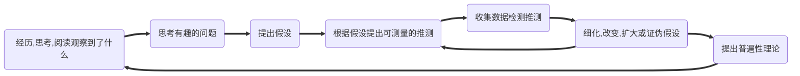

#flashcards 
# 概述
[学习](obsidian://open?vault=obsidianPrivateNote&file=%E7%AC%94%E8%AE%B0%2Fmindmap%2F%E5%AD%A6%E4%B9%A0.xmind) 
> [[费曼技巧|费曼]]难以理解的【20分钟】
> 阅读与记忆是基础，想象与创造是目标

> [!NOTE] 核心
> 学习，就像健身时虐待肌肉一样，压榨、虐待大脑。
> 练习：怀着实现某个既定目标的有意的意识与意图，来反复参加某项活动
## 本质
1. 学习就是在脑中构建并不断调整一个外部世界的内在模型
	1. 不断调整心理模型的参数。通过不断地尝试，即时纠正
		1. 将错误降到最低
	2. 组合爆炸。增加参数时，通过组合会产生指数级别的可能性。
		1. 开放心态、探索并拥抱各种可能性
2. 怀着实现某个既定目标的有意的意识与意图，来反复参加某项活动
# 原理
1. 人类的大脑与肌肉不同，肌肉长时间处于紧张状态必然产生酸痛，**长时期的脑力劳动却不会使大脑疲倦**。
	1. 有位女学生，连续12个小时从事脑力劳动，结果发现，她仍然能始终如一地演示各种心理功能，只是效率上略低。但是原因不是大脑累了，恰恰相反，是身体的*其他部位支撑不住了*。
	2. 一直努力吧，脑力没有极限。身体休息时让大脑继续回忆。
# 背景
学习开始
过程导向
视角
创造期望
变化
4S
平静
孩子身上学习
## 轻松的学习只是白费力气
轻松
	1. 不动脑子地画重点，重读、抽认卡、重读笔记
	2. 集中练习
	3. 一个字一个字地阅读
	4. 长时间大量获取
	5. 不做题
		1. 容易高估自己的水平
		2. 考试才发现自己想不起来
努力：就是虐待大脑
	1. 规律测验，努力回忆，间隔重复，交叉练习，高难度
		1. 学会提出关于知识的好问题，构建高质量的测验内容。
		2. 一遍一遍地、间隔地回忆并反思自己的经历
		3. 重复检索能把知识和技能深嵌在头脑中，使其成为条件反射
	2. 延迟反馈。晚一点反馈，吸收效果比及时反馈效果更好
	3. 理解：重述，理解在不同语境下的不同意义，创造
## 学习只是手段/工具
不要把学习本身当作目的。
**你想做什么？热爱什么？** 重要的是学习的动力、目标。朝着某个方向努力，学习是完全自动发生的。
# 心法
**对基本原则的透彻了解，是提高学习成效的关键** 
## 不要只是想，却做
## 信心、态度、方法
相信自己可以做到，
积极：正视、关心、关注一件事
方法：做一件事时

## [[意识]] 
对内部与外部世界的，连续的认识与反应。

听见心里的声音，外界的声音。
看见心里的画面，外界的画面。

不要让思维乱跑，掌控自己。把它们放走。

无法高效驾驭思维这匹马，就无法快速，甚至无法到达地点。
## 自控
## 耐心
耐心与自律的问题是，要培养它们中的任何一个，需要同时具备它们两个。
说明什么？说明这两个是元能力。
1. 人生就是漫长的练习
	1. 练习的心态影响一切。练习的方法呢？
	2. 不断地优化各种[[人的行为]]的努力。【身体和心理方面的行为，不断练习】
	3. 人生中值得去做的每一件事情，都需要练习。去坚持投入时间
	4. 所有的半途而废，都是因为不擅长**练习技能**这个过程本身
	5. 在日常生活中谋求改变。
		1. 不要练习了许久，却没有入门，甚至没有进步。永远倍感挫折
		2. 反复地用错误的方法练习击球，不改变，却期望更好的结果。
	6. 稳定地提高水平，并感受快乐。
	7. 如何在不感到失败和焦虑的前提下努力去实现目标？
	8. 正确理解、量化技术细节、目标制订。
		1. 量化成实实在在的东西。
	9. 分心。练习的心态是安静的
		1. 不要一心多用。
	10. 为何你不论做什么事，热情都会慢慢消散？
	11. 卓越的练习心态
		1. 不会让你倍感压力地在内心预期：“我什么时候才能达到目标？
		2. 具备最起码的自律和耐心，否则，你的焦虑和失败感将会大幅度上升。
2. 以过程为导向，而不是结果。【过程思维，而不是结果思维】
	1. 专注于实现目标的过程，从这个过程中找到乐趣，而不是拥有这个目标
	2. 当我们试图理解自己以及我们对人生中各种努力的痛苦挣扎时，可以通过观察一朵鲜花来找到平和。问你自己：一朵鲜花的生命，从撒下种子到完全盛开，在什么时候可以达到完美？
	3. 现代社会几乎都在关注结果。只关注你成就了什么，而不关注你在这个过程中做了什么，付出多少努力。这种评判方式会带来压力、焦虑、让人
		1. 不要想“我需要多久才能和那个人一样”。这种结果思维会把训练变成苦差事。
3. 改变[[视角]] 
	1. 为何会焦虑、挫败感，总是想要放弃？
		1. 认为存在一个“完美”状态
		2. 总是把当前跟期望的“完美”相比较，认为某个状态才是完美的。【观察一朵花，一朵鲜花的生命，从撒下种子到完全盛开，在什么时候可以达到完美？】
	2. 期望：**把目标实现的画面当成鼓励，十分有益。把目标当成衡量标准，则可能导致失败**。
		1. 期望可能不切实际，甚至不是能够达到的目标。而且期望与真正的幸福无关。
		2. 在任何事情上，当我们采用完美的画面来对照，通往幸福的路就可能出现重大的曲折
		3. 广告就是如此，给我们营造一个期望的画面。让我们觉得那样的才是完美的，甚至才是合理的。导致我们如果不得到那个东西，心里就一直不舒服。
	3. 结论
		1. 期望、参照点只能用于作为鼓励。切忌用于比较、衡量，否则
			1. 总会觉得生活中有不正确/不完美/不舒服的地方。
			2. 总想一下就达成目标，一口吃成胖子。驾车到别处去时，恨不得一下子就开到那里。
			3. 结果的期待，把自己的思维和精力从当下分散
			4. 抵触所带来的应激与压力，使人疲惫不堪
			5. 这种将当下与期望对比的思维过程，让你感觉无比遥远，压力巨大。
		2. **当你把思维和精力放在当下所从事的每个活动时，便是完美，如释重负**。
		3. 把目标放在心里，成为一种鼓励的动力
4. 创造期望、渴望
5. 感知变化，创造耐心
6. 4S
7. 平静
8. 从孩子身上学习
9. 技能在成长
## 视角
任何是何你以为你理解了若干个事物/事件，换个角度
## 自律
## 态度
1. 态度
	1. 贪多求快，囫囵吞枣
		1. 以慢为快
			1. 把慢工夫用在有[[价值]]的[[问题]] 
				1. 学外语：如果你的目的是沟通，那么有价值的问题不是[[语法]]与[[修辞]]，而是会影响沟通的东西
				2. 专业：吃透**理论的本质** 
				3. 永远不要想毕其功于一役，一次就能干到位，就能90分甚至100分。
			2. 学习本身从来不是你的目的。你的目的不是读完，而是**融会贯通，解决所有类似问题**。
			3. 每看完一小节，就整体回忆一下。有价值的问题，值得反复思索
			4. 不完美
				1. 先创造一个不完美、有缺陷的东西，再通过不断改正去深入理解
		2. 不要用有限的生命追逐无限的[[知识]]。提高[[认知效率]]而不是[[技术效率]]。
	2. 蜻蜓点水，浅尝辄止
	3. 专找捷径，急于求成
		1. 平衡做事前的研究与做事（10%的时间搜索资料、课程、教材）
			1. 知道自己在拖延时，开始去做就对了
			2. 资料的选择也需要在做事进行的时候重新评估
2. 成就=正确算法\*大量重复
3. [[思维]]方式大于技巧
	1. [[概念]] 
	2. 概念之间是==如何联系==的。人记住大量知识的唯一方式：概念之间联系很多（几十根安全带拉着的人不会掉下去）
	3. 纳入已有的知识系统
	4. 知识的构建方式，比知识本身更重要。
4. [[费曼技巧]]：最大程度*简化，压缩*（用最简单的词汇解释最复杂的知识）知识，再进行推演/[[推理]]/演化
5. [[意识]]存在。不抗拒，抵触。观察到每个要素的存在。
	1. 每次起心动念。
6. 清晰。
	1. 对待自己。细心、认真、仔细，在意细节。不要有模糊，似是而非，含糊其辞的表达、思考。
	2. 待人接物。适当的模糊，钝感，糊涂，柔和。因为要面对复杂的人性。
	3. 混乱、无法专注的心不能学习任何东西！
7. 坚定。仔细思考后做了决定，就不移地执行，不被分心、恐惧。
## 动力
不是外界（学习，工作，生活）无趣，而是你无趣。不会在任何事情中发现、创造乐趣
## 手感、手气
热手效应：手气的神秘与科学
	1. 篮球运动员手感极佳，连续投篮命中，那他的下一投也很可能命中。
	2. 爱因斯坦最伟大的发现在几个月内面世，莎士比亚最好的作品成群结队而来
## 活动
1. 多用脑，少用眼，不用手。
	1. **多次回忆当时的知识/行为，一切就会变成条件反射** 
		1. 为何深蹲时重心前移？如果前脚掌给足够的力，去撑住。是不是即使上半身俯身太多，也能瞬间发现，并通过前脚掌发力把重心调整回去？
		2. 为何知识没有想起？为何会恐惧？哪里没做好？
2. 每天写日记
	1. 回忆今天的收获、思考，
# 误区
[[阅读]] 

# [[策略]] 
是内心、感情、身体、思维同时作用的结果。
## 反馈
1. 积极反馈：能够指引未来方向、说明自身问题
	1. 分类
		1. 结果型：做对了/做错了
		2. 信息型：哪里错了
		3. 纠正型：应该怎么做才是对的，修正的方法。【指引着通往正确的路】
	2. 使用【发现那是错误的行为，本身就是了不起的事情】
		1. 高效反馈：即要给出结果型，也要给出纠正型
		2. 试错（反馈）对于进步，就像运动对于运动水平提高，是不可或缺的。
		3. 了解自己为何会无敌、犯错、粗心。
		4. 设计有效失误/失败/错误。
			1. 错误与达成一样有价值，甚至更有价值。因为人永远有进步的空间，错误让你发现它们
2. 负面反馈：针对个人的
	1. 赞美：聪明、厉害
	2. 批评：懒惰、拖延
3. 奖赏
	1. 分心时产生了许多念头/冲动，如果记忆任务完成，则让那些念头还以为自己的奖赏。
	2. 奖赏要求
		1. 分寸。这个分寸得使你不要从正在做的事情中离开太久，而看电影，则完全把你的心思转移开来了，使你远离了正在做的事情，
		2. 得看成果。奖赏应在优秀地完成某些具体工作后才能获得，而这个学生为了获得这种奖赏，匆匆完成了表面的工作。
	3. 奖赏举例：喝杯茶，走动走动，或者凭窗远眺，做几次深呼吸，冥想。
4. 错误：有时候，故意创造一个错误，然后在**不断修正错误**，是不断逼近正确答案的最短路径。
## 基础
不断回归基础
对于基础的理解，永远可以不断地加深。对于基础的理解深度，是个无底洞。

## 深度
浅层学习：记忆知识、事实
	1. 有些科目只适合浅层学习，而不是寻找意义，背景，联系
深层学习：对抽象意义与现实的理解与掌握
	1. 一个典型的学科，包含一些**大概念**和一些**小细节**。最好的方法是先从*大概念入手*，它们可将小细节联系在一起。主要是因为许多细节看似随机，其实通过大概念理解时，就发现了关联

## [[联系]] 
通过[[联想]]建立
	1. <u>将新的记忆材料纳入已有结构</u>。通过讲故事或[[隐喻]]的方式将新观念与已知观念（基础的概念与判断）建立联系。
	2. 错误的联想方式可能有负作用。构成联想的方式，既能为回忆提供便利，也能使回忆更加困难
富有创造精神的人，表现出*坚持不懈地寻找联想*的特性
	1. 他们的精神一贯处于紧张活动状态，善于把每个联想都作为发现新事物的跳板。
	2. 积极寻找其他联想。编织广泛的联想网络
	3. 有效[[记忆]]的关键是联想结构

对象
	1. 背景
	2. 已记忆的信息。
	3. 两个概念
## 时间
1. 时长
	1. 每次只学习30-50分钟。一次学习太多内容，就像肌肉一次训练太多，后面的都是**垃圾时间**，甚至有负作用。
		1. 要有足够的反思、消化时间。重要的不是持续时间、内容数量，而是频次。
		2. 45分钟学习+15分钟休息。**50分钟学习+10分钟休息** 
2. 时间
	1. 早起时最适合对需要[[记忆]]的东西进行编码。
		1. 心理学研究表明，晚上八点到十点，人们的大脑皮层处于最兴奋状态，*记忆系统最为活跃*，对信息的回收能力也最强。
	2. 晚间，思维活跃，往往是[[理解]]的最佳时间
## 对象
1. 提高[[认知效率]]，而不是[[技术效率]] 
	1. 只学习需要的，重要的，核心的。
2. 要学习的是知识的构建过程，而不是知识本身
3. 目的与方法
	1. 要做的是给自己的公司取名，而不是到处搜索，学习取名的方法
## 复习
#  知识
## 本质
定义：一张大网，要了解***事物的真正含义***，就要把这个事物与了解的其他事物[[联系]]，试图寻找、创造==知识间的关联==，并变成自己的观点。不要只见树木，不见森林。记忆只是学习的一少部分，要**全面地、联系地**认识学习，从**各种角度**看问题。

掌握知识的本质就是建立大网。==没有知识网，就没有学习==。
![[整体性学习.svg]] 
## 分类
1. 整体性学习：信息的结构
	1. [[观点信息]] ：是什么，为什么
	2. [[随意信息]] 
	3. [[过程信息]] ：如何做
	4. [[抽象信息]] 
	5. [[具体信息]] 
2. 超速学习
	1. 概念：理解
	2. 事实：[[记忆]] 
	3. 程序：练习
	4. 元知识：掌握
3. 方向
	1. 自我认知【见自己：一切学习的基础】：[[心理学]]，[[哲学]] 
	2. 做人乐趣【见自己：慢生活】：爱好，带来幸福，可做一生
	3. 做事效能【见众生：高效能】：生活、工作技能
		1. 工作时间，完成工作
		2. 业余时间，做饭，家务，照顾他人，爱好
	4. [[世界观]]【见天地】
		1. 视野，见识
## 联系
联系，存在于一切事物之间
1. 结构[^1] 
	1. 一系列紧密联系的知识。所有==知识及其联系==的总和。知识结构是大脑中的==地图==（每个地点及其联系）。建立结构就是创建地图，在每个地点之间联系，在各种知识之间建立**尽可能多的联系**。
	2. 每遇见一个新知识都要努力建立**良好**（概念之间的联系非常多，且有条不紊）的结构（是一座设计良好的城市）。
	3. 举例：成熟的结构（模拟其他知识最好的途径）
		1. 感知结构：其他结构的基础。五感
		2. 关系结构：A与B相邻→A与B是邻居
		3. 交通：四通八达，虽然流量很大却从不堵塞。
2. 模型[^2]：被简化的结构，结构的雏形。一种强大的提示，帮助想起所有知识。【不会运用，是因为没有在大脑中抽丝剥笋，形成==知识点的极简模型==】
	1. 目的：**压缩信息**，用于快速学习新概念。把多个关键思想压缩在一个点，可用于在上面添加新内容。对于快速学习新概念非常重要（新的知识在这个基础上进行联系与优化）。
	2. [[内视觉]]，简单把**最底层，最核心**的几个知识压缩在一起。不需要很精确，只要把一些观念综合起来，使它们更容易理解，把握。在这个基础上不断理解与纠正，*引申*出一个学科的全部知识。
	3. 举例：可以它为原点压缩结构
		1. “变量”的模型就是多种罐子。
		2. 函数的模型就是一个铅笔刀。给一个输入还一个输出；一本书的目录；[[git]]中的commit
3. 高速公路：结构之间的关系
		1. 用另一个科目/生活去模拟，比喻知识。如：生活经验
		2. 人们总在强调良好的结构，高速公路却能带来创造力。它把不同的专业科目联结在一起，建立起新结构，产生新知识。（治理国家的知识用于友谊，社会地位，管理等方面的经验）
# 拆解
==疯狂地改变，适应。把一切应用到生活中==。眼力和脑力逐渐觉醒，一切变得越来越有趣。
学习的策略与方法极其重要
## 学习目的
目标太高，是潜意识中不想努力，不想成功。
目标超小，越逼你面对现实。
	1. 5分钟记住一章的大纲

1. 清晰地思考这个世界、认识自己，就自发地读许多书，需要精通[[逻辑]]，[[语法]]，[[笔记/工具/修辞/修辞|修辞]]。
	1. 见自己，见众生，见天地
2. 减脂/增肌，就自发地学会了一切相关的知识
3. 宁静和快乐，所以努力学习、练习心灵类的书籍。
4. 功成名就，就自发地专注于钻研相关的内容
5. 爱因斯坦的目标不是成为世界上最聪明、知识最渊博的人。他受到科学的启发，想看到整个宇宙，想解释整个宇宙的工作原理。

不是
	1. 机械地创造量变。一天读了多少章
	2. 纯靠[[记忆]]来解决问题，通过考试。
	3. 把别的地方的知识*搬运*到笔记中
	4. 花大量时间，大量努力，搞垮身体与内心。却忘得很快。
	5. 大脑只是复读机，没有原创能力与解决问题的能力
是
	1. **知识是如何构建/构成与取得的，而不是知识本身**。
		1. 即：看看厉害的人，[[理解]]主题如何被拆解成不同要素
		2. 标示出最具挑战性的概念、事实与程序
		3. 概念知识需要[[理解]]，事实知识需要[[记忆]]，程序知识需要练习。
		4. 自己把这一切弄清楚，*而非只是抄袭或背诵某些定理是如何被证明出来的* 
		5. **信息的组织方式**（大网）本身就便于快速学习、深刻理解、轻松记忆。
		6. **知识点如何联系起来发挥作用**？孤立的知识是无法被使用的。
		7. 学着去**重建答案**，会更擅长
	3. 学得快、理解深、随时想起、灵活运用、会评估、擅创造。
		1. 做任何事都能又快又好
	4. 心理上的费力，而不是生理上的费力
		1. 脑子做了多少事情，而不是手上、嘴上做了多少功。
		2. 融会贯通，打通了[[知识]]之间的阻塞，能解决所有底层原理相通的[[问题]]。
			1. [[概念]]的特征，作用，之间的联系
			2. 对某个[[主题]]的认识更深入，吃透

不同的**目的**，对应完全不同的
	1. 学习深度。对于不同的知识，根据目的，进行不同深度的学习。
### [[内心]] 
[[当下]] 
### [[健身|身体]] 
行为的彻底改变
### [[思维]] 
1. 形成知识网，心智模型、学习风格
2. 费曼：解释问题、解决问题、预测问题
## 学习/技术
1. [[PBL]]：将学习作为次要，目的作为主要。基于问题的学习法
	1. 
2. 在不同主题/学科，穿插练习
3. [[游戏式学习]] 
## 学习[[学习的阶段|阶段]] 
不同的阶段，针对不同的知识类型，有不同的目标、技术
阶段之间并不是完全独立的，123可能同时进行
### 浏览
创建支架
	1. 与情境联系：解释当前知识要如何学习，为什么要学习
	2. 与具象联系：使用类比和比喻。【大脑没有进行抽象思考的能力】
### [[提问]] 
### [[获取]] 
尽量穿插获取
1. [[快速阅读]] 
2. [[笔记流]]：大脑喜欢简单有序的信息
3. [[PQ4R]] 
### [[理解]] 
将所有关键概念形成模型、创建==意象==，将模型与已知联系起来形成结构。
	1. 人类的大脑并没有进行抽象思考的能力。必须引入类比和隐喻
### [[记忆]] 
### [[拓展]] 
目的：形成高速公路
1. [[分析]] 
2. [[综合]] 
3. [[抽象]] 
4. [[概括]] 
### [[应用]] 
观察理论在实际中如何运行。往往是学习的终级目的。
### [[评估]] 
每过一小段时间，就停下，反思评估
	1. [[笔记/学习/概念/测试|测试]]：最有效的学习策略之一
		1. 不用于解决问题，永远不知道自己对知识的掌握程度
	2. [[反思]]：
		1. 最重要的技能：评估自己的假设，心理，技术，整个过程的[[人的行为|行为]]，结果。
		2. 确认自己是真正理解了，还是只是熟记笔记、用时间堆砌出了流畅的幻觉
	3. [[纠错]] 
### [[创造]] 
[[创造力]]比知识更重要
### 问题
1. 开始前
	1. 检视阅读
	2. 回忆已知
2. 学习中
	1. [[交叉训练]] 
	2. [[知觉学习]] 
	3. [[教学相长]] 
	4. [[基础思维]] 
	5. [[本质]] 
	6. [[偏见]] （观察**角度**要全面：**广度**）
	7. 肤浅（深度理解）
	8. 孤立（联系）
	9. [[错误]] 
	10. [[提问]] 
	11. [[记笔记]] 
	12. 联系：重述、与已知建立联系，能同时解决理解和记忆。
3. 结束后
	1. 怎么使用？
[[布鲁姆分类法]] 
## 内容
1. 资源。挑选一种资源，或许是一本书、一门课或一种学习方法，然后在一段预先决定好的期间拚命利用
2. 技巧。要学什么技巧？
3. 风格。技巧精熟一点之后，困难点会转到你想培养的风格
# 境界
**不断探索极限** 
1. 化境：技能内化于心、骨头、血液，像不存在一样。
	1. 对工具本身没有察觉
	2. 技能只是用来表达内心思想、情绪的工具（已臻化境）
2. 空境：我化入了天地宇宙
	1. 物我两忘。当下不存在事物，也不存在我
		1. 我就是眼前的这辆汽车，它自己知道自己应该怎样运作，比“我”操作好许多
		2. 我在打羽毛球、运动
		3. 我就是雪、是遇到的所有人
	2. [[臣服]]，是一切需要做的事情
	3. 超脱常规的主观、客观的二元对立。而是**合一**的
	4. 问题的答案或许在另一个房间、城市、世界。
	5. 期待事物，事件，人改变，是一种支配，而不是“适应”。
		1. 人无论做什么，都永远无法改变对方的人、事物、事件，每个人都只能自己改变自己。
## 知识的境界
### 深度
1. 执行能力
	1. 时间管理
	2. 资料保存
	3. 沟通谈判
2. 专业能力
	1. 打完整战役，系统解决问题。让所有棋子在合适的时候出现在合适的地点，做重要的事情。
3. 结构能力
	1. 认识事物更加底层的结构与规律
		1. 产生
			1. 为何
			2. 如何
		2. 运行
			1. 根本动力
		3. 改变
			1. 影响事物存在及其运行状态的因素
		4. 发展
			1. 脉络
学习的重点首先是结构能力（底层思维与方法），其次才是专业能力（知识与技能）。
	1. 象棋：学最基本的原则，而不是快速击败对方的方法
### 价值
1. [[软技能]] > 硬技能
2. 认知效率 > 技术效率
3. [[临界知识]] > 技能知识
4. 日常生活 > 书本
## 认知的深度/境界
跳出知识本身
分析问题时
	1. 能跳出问题，思考更普遍的情况
寻求答案时
	1. 能根据理由可信度判断是否接受这个答案
### [[布鲁姆分类法]] 
1. [[记忆]] 
2. [[理解]] 
3. [[应用]] 
4. [[分析]] 
5. [[评估]] 
6. [[创造]]/[[综合]] 

## 科学方法流程

## 环境
# 学习误区
# 方法
## 笔记
记录，阅读，分析，反思。
![[学霸课.jpg]]

# 反思
1. 学过的内容有没有用上？
2. 正在学的是什么知识？应如何使用？有没有过类似的知识
3. 有没有创建图象与联系？当前使用的是什么记忆技术？
4. 对应这个知识点，当前处于学习的哪个阶段？
5. 有没有对知识点间隔复习？
6. 有没有利用当前知识点创造些东西？
7. 这些内容就是我的总结吗？我还能对这些总结内容做点什么？简化？内在化？比喻？图表法？定桩？纠错
8. 为何没法把那些知识融会贯通，化为整体理解？？

[^3]: 压缩过的结构
