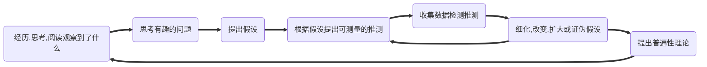

# 目的
不是
	1. 读得多，读得快
		1. 一天读了多少章
是
	1. 融会贯通，打通了知识之间的阻塞，能解决所有底层原理相通的问题。
		1. 一个概念的意义，作用，影响范围
		2. 弄明白一个概念的意思，可能要5，6天
	2. 做任何事都能又快又好。
	3. 对某个主题的认识更深入，吃透
	4. 

# 策略
使用了正确的方法，努力都有意义。你在进行某个行为时有在有意识地使用相应的方法吗？

提高==认知效率==，而不是==技术效率==
	1. 太多人忙于提高认知技术[^1]
		1. 看书，报培训班，学习业务知识，新的软件技能
		2. 概念及其关系你都知道。遇到问题时却不会主动出现。
		3. 总是在解决**看似不同，其实符合同一规律**的重复问题
	2. 认知效率
		1. [[临界知识]]：问题、现实的[[本质]]/规律，解决方案的底层规律
训练过程中
	1. [[交叉训练]] 
	2. [[知觉学习]] 
	3. [[教学相长]] 
	4. [[基础]] 
	5. [[本质]] 
	6. [[偏见]] （观察角度要全面）
	7. [[遗漏]] （内部组成、层次要全面）
	8. [[错误]] 
	9. [[提问]] 
训练之间
	1. [[间隔重复]] （减小单次持续时间，增加次数）
	2. [[睡眠]] 
	3. ==主动回忆== 
# 心法
1. 以慢为快
	1. 大忌
		1. 一口气学几个小时
		2. 你的目的不是读完，而是消化，是解决问题。
	2. 高效的学习，只是知识融会贯通的附加结果，不是主要结果。
	3. 把慢工夫用在==有[[价值]]的问题== 
		1. 学外语：有价值的问题不是语法与修辞不会，而是会影响沟通的东西
		2. 专业：吃透理论的本质
2. [[思维]]方式大于技巧
	1. 概念之间是==如何联系==的
	2. 概念之间==联系的数量==越多，记忆效果越强，越不可能被忘记。（几十根安全带拉着的人不会掉下去）
3. 对知识进行最大程度的简化，压缩（用最简单的词汇解释最复杂的知识），然后进行推演/[[推理]] /演化
4. 与其每天看书，文章，技巧，不如更多关注自己。
5. 定下一个目标，==每天观察自己和目标的差距==。
6. 不要重读、划重点、总结概述，而是通过[[提问]]来复习。

## 知识分类
### 结构
引路：[[知识]] 
1. 整体学习
	1. 观点
	2. 随意
	3. 过程
	4. 抽象
	5. 具体
2. 超速学习
	1. 概念：理解
	2. 事实：记忆
	3. 程序：练习
	4. 元知识：掌握

### 深度
1. 执行能力
	1. 时间管理
	2. 资料保存
	3. 沟通谈判
2. 专业能力
	1. 打完整战役，系统解决问题。让所有棋子在合适的时候出现在合适的地点，做重要的事情。
3. 结构能力
	1. 认识事物更加底层的结构与规律
		1. 产生
			1. 为何
			2. 如何
		2. 运行
			1. 根本动力
		3. 改变
			1. 影响事物存在及其运行状态的因素
		4. 发展
			1. 脉络
学习的重点首先是结构能力（底层思维与方法），其次才是专业能力（知识与技能）。
	1. 象棋：学最基本的原则，而不是快速击败对方的方法
### 价值
1. 软技能 > 硬技能
2. 认知效率 > 技术效率
3. [[临界知识]] > 技能知识
4. 日常生活 > 书本
## 学习深度
[[布鲁姆分类法]] 
## 认知深度
分析问题时
	1. 能跳出问题，思考更普遍的情况
寻求答案时
	1. 能根据理由可信度判断是否接受这个答案
# 学习方法
1. 工具选择
	1. [[思维导图]]用于记忆知识框架，提供知识地图
	2. [[记忆宫殿]]用于记忆具体知识点
	3. 概念图用于检查知识盲点
2. [[PBL]] 
3. [[SQ3R]] 
## 学习阶段
重点是获取与消化。学习是一个生长与创造的过程
### 常规流程
1. [[浏览]] 
2. [[提问]] 
3. [[获取]] 
4. [[理解]] 
5. [[记忆]] 
	1. [[间隔重复]] 
	2. 必须使用图象与[[联系]]，感情
		1. 图象直接使用==中介==联系
			1. 动词、故事
		2. 图象依附于==熟悉的事物==
			1. 逻辑、桩子
6. [[拓展]] 
7. [[应用]] 
	1. 交替使用不同技能，而不是大量重复磨炼某个技能
	2. 抓住问题的本质，进行大量的持续练习
8. 评估
	1. [[反思]]：最重要的技能：评估自己的假设，心理，技术，整个过程的[[人的行为|行为]]，结果。
9. 创造


### 科学方法流程

## 环境
# 学习误区
# 方法
1. 针对学习不同阶段、知识的不同种类，在不同知识之间建立联系。
2. 读三遍
	1. 快速通读，掌握整体概念
	2. 应用到生活中
	3. 使这些方法成为第二天性

![[学霸课.jpg]]

# 时刻反思
1. 学过的内容有没有用上？
2. 正在学的是什么知识？应如何使用？有没有过类似的知识
3. 有没有创建图象与联系？当前使用的是什么记忆技术？
4. 对应这个知识点，当前处于学习的哪个阶段？
5. 有没有对知识点间隔复习？
6. 有没有利用当前知识点创造些东西？
7. 这些内容就是我的总结吗？我还能对这些总结内容做点什么？简化？内在化？比喻？图表法？定桩？纠错
8. 为何没法把那些知识==化入血液里，融入骨头中，融会贯通，运用自如==？？？？？？？？？？？？？？？？？？？？？？？？？？？？？？？？？？
```ad-note
title: 记忆
collapse: open
专业知识的获取、复习、技能（代码，记忆，理解，阅读，思考，画画）的练习都要拉开间隔，才能永久记忆

```

[^1]: 永远在学习新技能。为什么你每遇到个“新问题”，就要学习新知识？