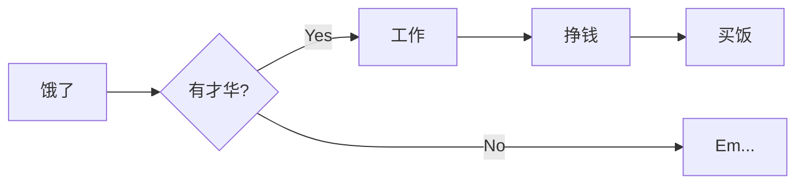

``` mermaid
graph LR
  A[饿了] --> B{有才华?};
  B -->|Yes| C[工作];
  C --> D[挣钱];
  D --> E[买饭];
  B ---->|No| F[Em...];
```

![[Pasted image 20231031114813.png]] 
1. 功能
	1. 执行主体、执行内容
	2. 内容的顺序、步骤、过程
2. 场景
	1. 事件、任务